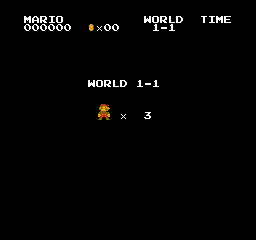
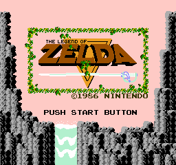
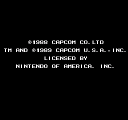
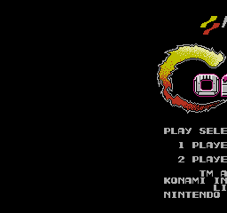
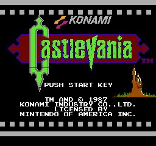
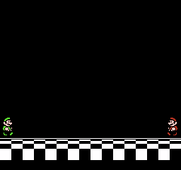
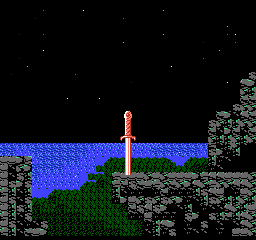
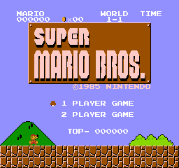

# 🎮 NES Emulator in Rust

[](https://github.com/AFE123xr/NES-Emulator/actions/workflows/ci.yml)
[](https://www.rust-lang.org/)
[](https://opensource.org/licenses/MIT)
[-success.svg)](#testing--verification)
[](#cpu-ricoh-2a03--mos-6502)
[](#performance--benchmarking)

A high-performance, cycle-accurate Nintendo Entertainment System (NES / Famicom) emulator written completely from scratch in pure **Rust**, featuring pixel-perfect PPU rendering, a high-fidelity 5-channel APU with real-time audio diagnostics and WAV recording, comprehensive mapper support (NROM, MMC1, UxROM, CNROM, MMC3, AxROM), and hardware-accelerated SDL2 frontend.

---

## 📸 Screenshot Showcase

Captured directly from the emulator's PPU scanline pipeline:

| **Super Mario Bros.** (World 1-1 Gameplay) | **The Legend of Zelda** (Title Screen) |
| :---: | :---: |
|  |  |
| *Mapper 0 (NROM) • Fine scrolling & sprite multiplexing* | *Mapper 1 (MMC1) • Scanline split & Sprite 0 timing* |

| **Mega Man 2** (Title Screen) | **Contra** (Title Screen) |
| :---: | :---: |
|  |  |
| *Mapper 1 (MMC1) • Full 8x16 sprite rendering* | *Mapper 2 (UxROM) • Dynamic PRG bank switching* |

| **Castlevania** (Title Screen) | **Super Mario Bros. 3** (Title Screen) |
| :---: | :---: |
|  |  |
| *Mapper 2 (UxROM) • Background tile rendering* | *Mapper 4 (MMC3) • Scanline IRQ split screen* |

| **Zelda II - The Adventure of Link** | **Super Mario Bros.** (Title Screen) |
| :---: | :---: |
|  |  |
| *Mapper 1 (MMC1) • Battery-backed SRAM saving* | *Mapper 0 (NROM) • Classic 64-color NTSC palette* |

---

## ⚡ Key Highlights & Architecture

### 🧠 CPU (Ricoh 2A03 / MOS 6502)
- **100% Instruction Coverage**: Implements all 56 official 6502 instructions across all 13 addressing modes.
- **Unofficial Opcodes**: Full support for undocumented opcodes (`LAX`, `SAX`, `DCP`, `ISC`, `SLO`, `RLA`, `SRE`, `RRA`, `ALR`, `ARR`, `AXS`, multi-byte `NOP`s, etc.).
- **Hardware-Accurate Quirks**: Faithful replication of hardware edge cases, including indirect jump `JMP ($xxFF)` page-wrap anomaly and cycle-5 RMW dummy memory writes (critical for MMC1 consecutive-cycle write filtering in *The Legend of Zelda*).
- **Golden Master Verification**: Passes **100% of the `nestest` gold standard** (all 8,991 CPU instructions and cycles matched cycle-by-cycle against reference logs) and **Blargg's official instruction tests**.
- **Interrupt Handling**: Exact cycle timing for `RESET`, `NMI` (VBlank), and `IRQ` (APU frame counter, DMC DMA, and MMC3 scanline counter).

### 🎨 PPU (Ricoh 2C02 Picture Processing Unit)
- **Resolution & Timing**: Native 256×240 display resolution at ~60.0988 FPS (29,780.5 CPU cycles per frame).
- **Loopy Scrolling**: Full register architecture (`v`, `t`, `x`, `w`) with mid-scanline coarse and fine scroll manipulation.
- **Nametable Mirroring**: Dynamic hardware mirroring switching (Horizontal, Vertical, Single Screen Lower/Upper, and Four-Screen).
- **Sprite Multiplexing**: Supports both 8×8 and 8×16 sprite modes with priority sorting, horizontal and vertical flipping, and sprite overflow flag.
- **Precise Sprite 0 Hit**: Cycle-accurate evaluation for split-screen HUD status bars (e.g. *Super Mario Bros.* and *The Legend of Zelda* overworld).
- **NTSC Palette**: Authentic, vibrant 64-color composite video palette.

### 🔊 APU (Audio Processing Unit & Diagnostics)
- **5 Complete Audio Channels**:
  - **Pulse 1 & Pulse 2**: 4 duty cycles (12.5%, 25%, 50%, 75%), volume envelope generator, and sweep units (Pulse 1 with 1's complement negation, Pulse 2 with 2's complement negation, with continuous muting evaluation).
  - **Triangle**: 32-step pseudo-triangle wave, linear counter, length counter, and pop-free ultrasonic frequency handling.
  - **Noise**: 15-bit Linear Feedback Shift Register (LFSR) with 32,767-step pseudo-random and 93-step periodic looped modes, clocked at true CPU cycle periods.
  - **DMC (Delta Modulation Channel)**: Automatic 1-bit delta DMA sample playback, 7-bit DAC, frequency lookup table, and sample end IRQ.
- **Hardware Filters & Mixing**: Non-linear DAC synthesis formula, first-order low-pass filter (14 kHz), and dual first-order high-pass filters (90 Hz & 440 Hz) for DC offset removal.
- **Frame Sequencer**: Hardware 4-step (240 Hz / 120 Hz / 60 Hz IRQ) and 5-step sequences clocked accurately on APU cycles.
- **Audio-Driven Frame Pacing & DRC**: Dynamic Rate Control smoothly synchronizes emulation speed to the physical soundcard DAC, preventing buffer underruns.
- **Audio Diagnostics & `.wav` Export**:
  - Rolling 2-minute audio buffer recorded in real-time.
  - **F4 Hotkey**: Instantly dumps recent audio to a standard 16-bit 44.1 kHz PCM WAV file in `./audio_dumps/`.
  - **Auto-save on Exit**: Automatically writes the audio session to a `.wav` file upon closing the emulator for easy analysis.

### 💾 Cartridge & Mapper Support
Full iNES format parsing with battery-backed PRG RAM persistence:
| Mapper | Chip | Popular Supported Games |
|:---:|:---:|:---|
| **0** | **NROM** | *Super Mario Bros.*, *Donkey Kong*, *Pac-Man*, *Excitebike*, *Kung Fu* |
| **1** | **MMC1** | *The Legend of Zelda*, *Metroid*, *Mega Man 2*, *Zelda II*, *Kid Icarus* |
| **2** | **UxROM** | *Castlevania*, *Contra*, *Mega Man*, *DuckTales*, *Metal Gear* |
| **3** | **CNROM** | *Adventure Island*, *Solomon's Key*, *Gradius*, *Cyber Stadium Series* |
| **4** | **MMC3** | *Super Mario Bros. 3*, *Mega Man 3–6*, *Kirby's Adventure*, *Super C* |
| **7** | **AxROM** | *Battletoads*, *Marble Madness*, *Double Dragon II* |

---

## 🎮 Controls & Keybindings

### Player 1 Gamepad
| Button | Primary Keyboard Key | Secondary Key |
|:---|:---|:---|
| **D-Pad Up** | Up Arrow (`↑`) | `W` |
| **D-Pad Down** | Down Arrow (`↓`) | `S` |
| **D-Pad Left** | Left Arrow (`←`) | `A` |
| **D-Pad Right** | Right Arrow (`→`) | `D` |
| **A Button** | `Z` | `K` |
| **B Button** | `X` | `J` |
| **Select** | `Space` | Right Shift |
| **Start** | `Enter` | Return |

### Emulator Hotkeys
| Key | Function |
|:---|:---|
| **`F12` / `F2`** | **Capture Screenshot** (lossless 24-bit BMP saved to `./screenshots/`) |
| **`F4`** | **Save Audio Dump** (lossless 16-bit 44.1 kHz `.wav` saved to `./audio_dumps/`) |
| **`F3`** | **Toggle Audio Diagnostics** (real-time buffer health, underrun & pop monitor) |
| **`P`** | **Pause / Resume** emulation |
| **`R`** | **Reset** console |
| **`Tab`** | **Fast-Forward** (hold for uncapped speed, up to >750 FPS) |
| **`M`** | **Mute / Unmute** audio |
| **`F11`** | **Toggle Fullscreen** mode |
| **`Esc`** | **Quit Emulator** (auto-saves audio dump for review) |

---

## 🚀 Getting Started

### Prerequisites

- **Rust**: Latest stable toolchain ([Install via rustup](https://rustup.rs/)):
  ```bash
  curl --proto '=https' --tlsv1.2 -sSf https://sh.rustup.rs | sh
  ```
- **SDL2 Development Libraries**:
  - **macOS** (Homebrew):
    ```bash
    brew install sdl2
    ```
  - **Ubuntu / Debian**:
    ```bash
    sudo apt update && sudo apt install libsdl2-dev
    ```
  - **Fedora / RHEL**:
    ```bash
    sudo dnf install SDL2-devel
    ```
  - **Arch Linux**:
    ```bash
    sudo pacman -S sdl2
    ```

### Build

```bash
cargo build --release
```
The optimized standalone binary will be compiled to `target/release/nes`.

---

## 🕹️ Running Games

Run any standard `.nes` ROM file directly by providing the path:

```bash
# Launch a game at default 3x window scaling (768×720)
./target/release/nes path/to/game.nes

# Launch at 4x window scaling (1024×960)
./target/release/nes path/to/game.nes --scale 4

# Launch with real-time audio diagnostics enabled
./target/release/nes path/to/game.nes --debug-audio

# Run in headless benchmark mode for 1,000 frames
./target/release/nes path/to/game.nes --headless 1000

# View all CLI options and keybindings
./target/release/nes --help
```

### CLI Options

| Flag | Argument | Description | Example |
|:---|:---|:---|:---|
| `<rom_path>` | File path | Path to any valid iNES ROM file | `./target/release/nes roms/mario.nes` |
| `--scale` | `1`–`8` | Window scale multiplier (default: `3` = 768×720) | `--scale 4` (1024×960 window) |
| `--debug-audio` | *None* | Enable real-time audio buffer and underrun diagnostics | `--debug-audio` |
| `--headless` | `<frames>` | Run headlessly for $N$ frames without a window (benchmarking/testing) | `--headless 1000` |
| `--help`, `-h` | *None* | Display usage instructions and control bindings | `--help` |


---

## 🧪 Testing & Verification

The project enforces strict quality control through automated continuous integration (CI) and a comprehensive test suite covering CPU instruction accuracy, PPU rendering, APU audio synthesis, and mapper banking.

### Local CI-Dev Verification
Run the complete CI check locally with one command:
```bash
./scripts/ci-dev.sh
```
This automated pipeline runs:
1. **Formatting Check**: Verifies adherence to standard Rust style (`cargo fmt --check`).
2. **Compilation Check**: Validates that all library targets and binary entrypoints compile cleanly (`cargo check --all-targets`).
3. **Linter**: Enforces zero warnings with Clippy (`cargo clippy --all-targets -- -D warnings`).
4. **Release Build**: Compiles the optimized release binary (`cargo build --release`).
5. **ROM-Free Unit & Fixture Tests**: Runs all unit tests without requiring external ROM downloads (`cargo test`).
6. **Headless Execution Check**: Confirms CLI functionality and headless execution on `nestest.nes`.

### Running Tests Manually
```bash
# Run all unit tests and committed fixture tests (no downloaded ROMs required)
cargo test

# Run tests with live output
cargo test -- --nocapture

# Run cycle-accurate golden master CPU verification
cargo test --test nestest

# Run Blargg's official instruction tests
cargo test --test blargg_tests

# Run APU sound channel tests
cargo test --test apu_tests

# Run PPU registers and scrolling tests
cargo test --test ppu_tests

# Run mapper banking and IRQ tests
cargo test --test mapper_tests
```

### Verification Highlights
- **No External ROMs Required for CI**: Unit tests and integration tests use pure in-memory data or committed fixtures in `tests/fixtures/` (`nestest.nes`, `nestest.log`, `official_only.nes`). Optional tests requiring copyrighted commercial ROMs cleanly skip when `ROM_PATH` / `NES_ROM` is unset.
- **`nestest.nes`**: Matches all 8,991 CPU instructions and cycles against `nestest.log` golden master.
- **Blargg's `official_only.nes`**: All 56 official 6502 instructions pass.
- **Zero Warnings Policy**: Enforces clean `cargo clippy --all-targets` and `cargo fmt --check`.

---

## 🏎️ Performance & Benchmarking

Benchmarked on Apple Silicon (M-series) in release mode:
- **Headless Mode**: **748.9 FPS** (~12.5× real-time speed).
- **Interactive Mode**: Rock-solid **60.0988 FPS** with low-latency audio playback and sub-frame input response.

---

## 📁 Project Structure

```text
NES-Emulator/
├── .github/
│   └── workflows/
│       └── ci.yml                # Automated GitHub Actions CI workflow
├── scripts/
│   └── ci-dev.sh                 # Local CI-dev test & verification runner
├── Cargo.toml                    # Rust crate configuration & dependencies
├── build.rs                      # Native SDL2 library linking
├── README.md                     # Documentation and screenshots
├── images/                       # High-res screenshot showcase assets
├── screenshots/                  # In-game captures (F12/F2)
├── audio_dumps/                  # In-game WAV audio recordings (F4 / exit)
├── src/
│   ├── lib.rs                    # Public API exports
│   ├── main.rs                   # CLI arguments & entrypoint
│   ├── apu/                      # Audio Processing Unit
│   │   ├── dmc.rs                # Delta Modulation Channel (DMC)
│   │   ├── envelope.rs           # Volume envelope generator
│   │   ├── filter.rs             # 14 kHz low-pass & 90/440 Hz high-pass filters
│   │   ├── length_counter.rs     # Note length counters
│   │   ├── noise.rs              # 15-bit LFSR pseudo-random noise
│   │   ├── pulse.rs              # Pulse channels with frequency sweep
│   │   └── triangle.rs           # 32-step triangle wave channel
│   ├── audio/                    # SDL2 audio callback & diagnostics
│   │   ├── mod.rs                # Dynamic rate control & audio streaming
│   │   └── diagnostics.rs        # WAV exporter, buffer monitor & pop detection
│   ├── bus/                      # 16-bit CPU system interconnect bus
│   ├── cartridge/                # Cartridge header decoder & mappers
│   │   ├── header.rs             # iNES header parser
│   │   └── mapper/               # Mappers 0, 1, 2, 3, 4, 7
│   ├── controller/               # Standard NES joypad shift registers
│   ├── cpu/                      # Ricoh 2A03 / MOS 6502 CPU core
│   │   ├── addressing.rs         # 13 addressing modes
│   │   ├── opcodes.rs            # Official & unofficial opcodes
│   │   └── registers.rs          # Status flags and registers
│   ├── nes/                      # Console master coordination & clock stepping
│   ├── ppu/                      # Ricoh 2C02 Picture Processing Unit
│   │   ├── palette.rs            # 64-color authentic NTSC palette
│   │   └── registers.rs          # Loopy scrolling & status registers
│   └── ui/                       # SDL2 window, event loop & input handling
│       └── screenshot.rs         # Lossless 24-bit BMP screenshot exporter
└── tests/                        # Comprehensive test suite
    ├── apu_tests.rs              # Audio channel unit tests
    ├── blargg_tests.rs           # Blargg CPU instruction tests
    ├── capture_readme_screenshots.rs # Automated screenshot capture pipeline
    ├── mapper_tests.rs           # Mappers 0, 1, 2, 4 IRQ tests
    ├── nestest.rs                # Golden master nestest cycle verification
    ├── ppu_tests.rs              # PPU scrolling & VRAM mirroring tests
    ├── screenshot_tests.rs       # BMP export format regression test
    ├── zelda_audio_test.rs       # Zelda audio waveform & pop analysis
    ├── zelda_debug.rs            # Zelda menu navigation & scrolling test
    └── zelda_sprite0.rs          # Zelda overworld Sprite 0 split-timing test
```

---

## 📜 License

This project is licensed under the [MIT License](LICENSE).
